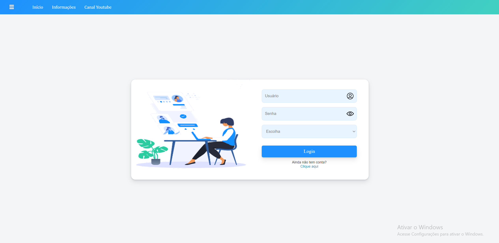
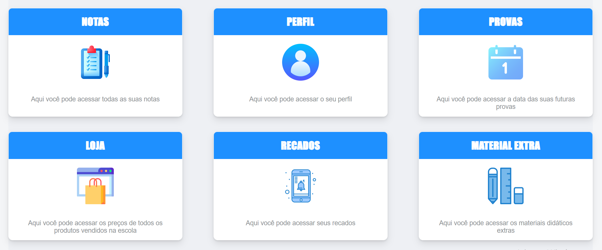
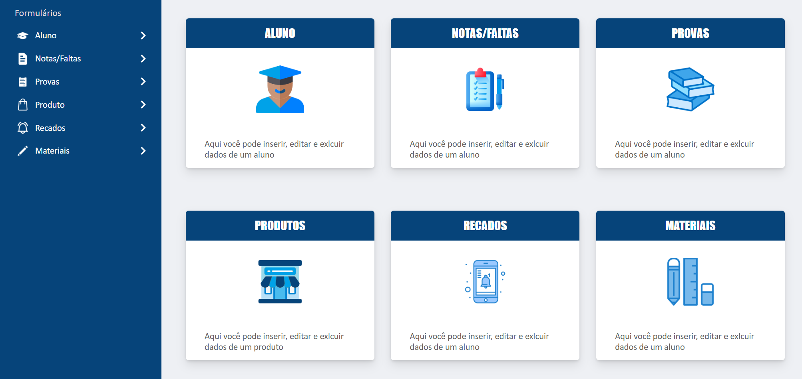

<h1 align="center">SPGE - Sistema Padrão Gerenciador de Escolas</h1>

 

<h2>Sobre o projeto 🔎</h2>
O SPGE é um sistema Web que possui o objetivo de facilitar a vida dos estudantes e funcionários das escolas. Com seu fácil manuseio e responsividade, o SPGE torna mais simples o acesso e a manipulação de informações escolares.
  

<h2>Tecnologias utilizadas 💻</h2>
<ul>
  <li>Java + Spring Boot;</li>
  <li>Javascript + JQuery;</li>
  <li>HTML + CSSS;</li>
  <li>Banco de dados MySQL.</li>
</ul>
 

<h2>Dependências Maven utilizadas ♦️</h2>
<ul>
  <li>Spring Web;</li>
  <li>Spring Data JPA;</li>
  <li>MySQL Driver;</li>
  <li>DevTools.</li>
</ul>
 

<h2>Recursos dos alunos 🧑‍🎓</h2>
<ul>
  <li>Visualização e emissão de pdf das notas;</li>
  <li>Vizualização dos dados pessoais/escolares;</li>
  <li>Vizualização dos dias e conteúdos de futuras provas;</li>
  <li>Vizualização dos produtos vendidos na escola;</li>
  <li>Vizualização dos recados emitidos pela escola;</li>
  <li>Vizualização de conteúdos e links adcionais (complementares âs aulas).</li>
</ul>
 

 

<h2>Recursos dos funcionários/professores 👩‍🏫:</h2>
<ul>
  <li>Inserção, edição e exclusão de todas as informações citadas no tópico anterior, além claro, da inserção dos próprios alunos no sistema.</li>
</ul>
 

 

<h2>Política de uso da plataforma 👩‍🏫</h2>
Cada escola poderia inseri-lá da forma desejada, porém eu recomendaria o seguinte modelo: criassem os perfis de todos os alunos com o nome de usuario sendo sempre o primeiro nome do aluno + "." + o ultimo nome do aluno. As senhas de inicio deveriam ser todas iguais, exemplo: nomeDaEscola2023. Dessa forma, todos os alunos deveriam trocar suas senhas no primeiro acesso. 
Com tal modelo seria certo de não ter nehuma irregularidade acerca das informações dos alunos, já que os cadastros seriam responsabilidades das escolas.
  

<h2>Passo a passo para rodar em seu PC</h2>
<ul>
  <li>Possua uma JDK 17 ou superior instalada em seu PC;</li>
  <li> Baixe ou clone o projeto em seu PC;</li>
  <li>Configure algum banco de dados MySQL, seja ele local ou de algum serviço externo (recomendo os do site RailWay) dentro do applications.properties. Para isso você precisa   do host, nome, porta, usuario e senha do banco de dados;</li>
  <li>Dê build ou compile no projeto usando alguma IDE (recomendo Intelij), para baixar todas as dependências;</li>
  <li>Por fim, dê start na classe principal do projeto (FutshopApplication) e pronto, ele já funcionará.</li>
</ul>
 

<h2>Link video 📺</h2>
https://youtu.be/6pFGh1nESVI
  

<h2>Link site :zap:</h2>
Desclupe, o site ainda não está no ar
  

<h2>Autor :raising_hand:</h2>

| [ Fabrício Ferreira Tavares](https://github.com/fabricionft) | 
| :---: | 
